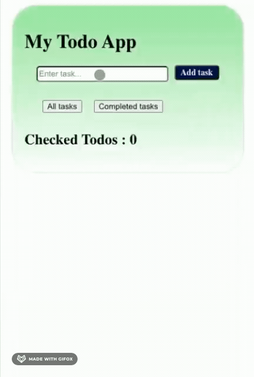

This project was bootstrapped with [Create React App](https://github.com/facebook/create-react-app).
<!-- TABLE OF CONTENTS -->

  
Table of Contents

  <ol>
    <li><a href="#about-the-project">About The Project</a></li>
    <li><a href="#project-demo">Project Demo</a></li>
    <li><a href="#built-with">Built with</a></li>
    <li><a href="#key-features">Key Features</a></li>
    <li><a href="#available-scripts">Available Scripts</a></li>
    <li><a href="#license">License</a></li>
    </ol>

<!-- ABOUT THE PROJECT -->

# About The Project
  

    

     In our day to day lives, we have multiple tasks to complete everyday. Sometimes, in all the hassle we forget the most-important tasks to be done.
     So here's an app, made by me, to manage your daily todos and make it easy for you to organise your tasks for the day. 
     This todo-app is user-friendly and attractive at the same time.
  

  
  
 <!-- PROJECT DEMO -->
# Project Demo
  

    

      
       
      <a href="https://drive.google.com/file/d/1Qc5vIZLZT_UxByxJmcWVYetHJ7jcIRiO/view?usp=sharing">View Full Demo</a>
  

<!-- BUILT WITH -->

# Built With

I have built this Todo App using the Javascript framework- REACT.JS 
  Styled it using HTML and CSS.

<!-- KEY FEATURES -->

# Key Features

  <ul>
    <li>Add Task</li>
    <li>Delete Task</li>
    <li>Check Completed Tasks</li>
    <li>View Checked Tasks </li>
    <li> Display of number of Checked Tasks</li>
  </ul>

# Available Scripts

 the project directory, you can run: 

`npm start`  

Runs the app in the development mode. 
Open [http://localhost:3000](http://localhost:3000) to view it in the browser. 

The page will reload if you make edits. 
You will also see any lint errors in the console. 

<!-- LICENSE -->
# License

Distributed under the MIT License. See `LICENSE` for more information.

